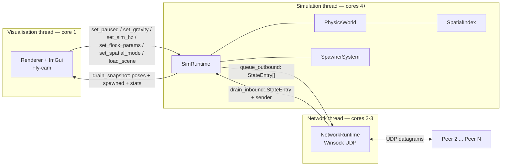
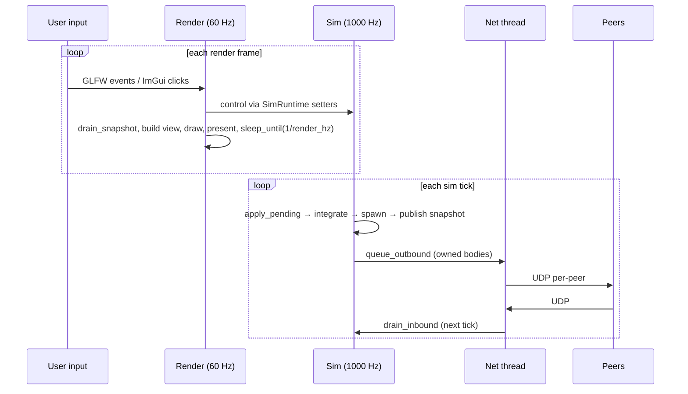

# System architecture

## Component overview

The application is a single Win32 binary that runs three pinned threads, communicating through small mutex-guarded blocks. Each thread owns a distinct concern; no thread reaches across to another's data.

`main()` pins itself to core 1 with `SetThreadAffinityMask(GetCurrentThread(), cores_to_mask(1,1))`. `SimRuntime` and `NetworkRuntime` set their own affinity from the entry of their thread function — `cores_to_mask(4, 8)` and `cores_to_mask(2, 3)` respectively. The masks are 1-indexed bit fields per the spec table.

## Sim ↔ render exchange

`SimRuntime` exposes a small command surface (`set_paused`, `set_gravity`, `set_sim_hz`, `single_step`, `reset`, `load_scene`, `set_flock_params`, `set_net_smoothing`, `set_spatial_mode`, …). Most live in a mutex-guarded "pending" block; one-shot flags (`reset_pending_`, `single_step_pending_`, `scene_pending_`) use `std::exchange` so each fires exactly once. Hot-loop reads (`paused`, `gravity_on`, `sim_hz_target`) are atomics so the render thread can poll without ever blocking the sim.

The reverse direction is `drain_snapshot()`. Each sim tick, the sim thread fills a `SnapshotData` (per-body model matrix + position + quat + linear/angular velocity + inverse mass and inertia, plus a delta vector of objects spawned since the previous drain, plus simulation time, contact count, body count, sim_hz_actual, spatial-index stats, and a monotonic `scene_version`). The render thread takes the lock, copies the body vector and **moves** out the spawn delta, then releases. Lock window: tens of microseconds for typical scenes.

The render thread therefore never touches `PhysicsWorld` or `SpawnerSystem` directly; it maintains its own mirror of `scene::Scene` and `instances` and keeps them parallel by appending each drained spawn delta. A change to `scene_version` (triggered by either a scene swap or a reset) prompts a fresh re-load from the scene file, dropping any stale local state.

Independent Hz is therefore intrinsic. The render Hz is enforced by `sleep_until(last + 1e6/hz)` after present; the sim Hz by `sleep_until(next_tick += 1e6/hz)`. Catch-up logic clamps `next_tick` so a long stall never silently inflates dt.

## Networking

`NetworkRuntime` opens one non-blocking UDP socket bound to the local peer's port. The thread loop calls `recv_pending()` (drains all available datagrams via repeated `recvfrom` until `WSAEWOULDBLOCK`), then drains the outbound queue and `sendto`s to every other peer.

Wire format is a packed `PacketHeader { msg_type, sender, sequence, entry_count, reserved }` followed by up to 24 packed `StateEntry { body_id, position, quat, linear_velocity, angular_velocity }`. 24 entries × 52 B + 8 B header = 1256 B, comfortably under the standard 1500-B UDP MTU on the lab LAN.

**Per-sender sequence filter**: each peer's last accepted sequence is kept in `last_seq_per_peer_[]`; signed 16-bit delta against the new packet drops late or duplicate packets and increments `packets_dropped_stale_`.

**In-app QoS shaper** (Phase 8): three atomics — `sim_latency_ms_`, `sim_jitter_ms_`, `sim_loss_pct_` — applied at send. Loss → roll vs threshold and skip. Latency+jitter → push the bytes into a `pending_sends_` vector with a `ready_at` timestamp; the thread loop drains entries whose `ready_at` has elapsed. Lets the worst-case 100 ms ± 50 ms / 20 % spec scenario be reproduced without an external tool.

## Ownership and authority

Every `RigidBody` carries `owner_peer_id` (0 = local-only for static / animated; 1-4 for simulated). Simulated bodies are integrated only by their owner peer; collisions are detected on **all** peers but `resolve_contact` only applies impulses + position correction to bodies the local peer owns. The effective-mass formula still uses both bodies' inertias so impulse magnitude is correct on both sides, and each owner applies the symmetric impulse to its own body. There is no central server — every peer is authoritative for its own bodies. Body id (= `scene_object_index`, deterministic across peers because all peers use the same scene file and seeded RNG) is sent on the wire; receiver looks it up directly.

## Drift correction

Inbound state writes a `net_target_position` + `net_target_orientation` and refreshes the body's velocities — but **does not snap** position/orientation. Instead, non-owned simulated bodies extrapolate locally each step using their last received velocity, then blend toward the target via `1 − exp(−rate · dt)` (and `slerp` for orientation). Convergence is smooth even with the spec's worst-case loss and jitter; the rate is ImGui-tunable.

## Other notes

- Scenes live in FlatBuffers (`schema/scene.fbs`). Authored as JSON; `flatc --binary` compiles to `.scene` at build. Schema extended with `BoidObject` and `BoidSpawner` for Phase 7.
- `SpatialIndex` (Phase 9) wraps a uniform grid and an octree behind one switchable interface. Build + query timings + memory bytes are sampled live and shown in the UI.
